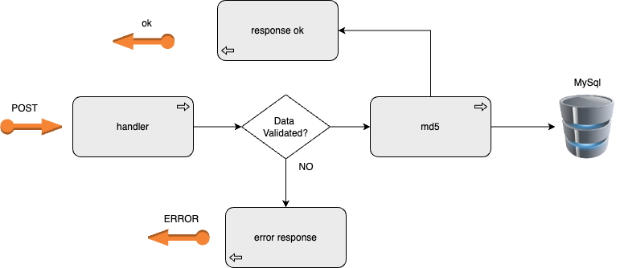
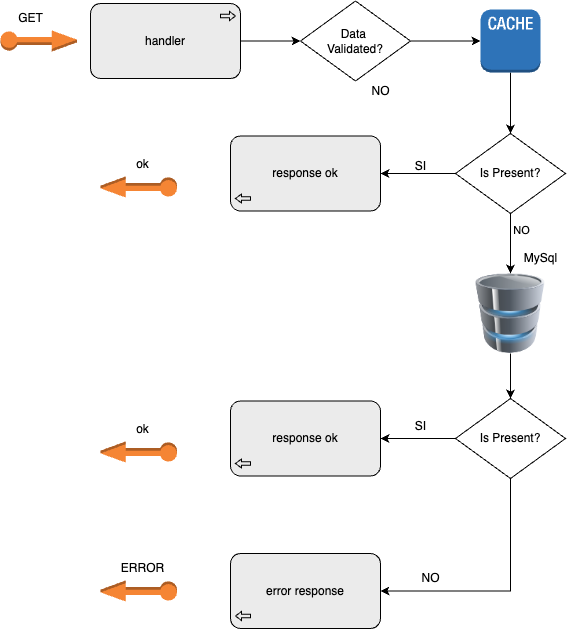

# **My solution for ShortUrl**

### **Context**

Shorturl is a service to create short url or alias or tiny url against a long url.
Moreover, when the user click on tiny url should redirect to original URL.
Tiny URL are exceedingly handy to share through sms/tweets (where there is
limit to number of characters that can be used messaged/tweeted) and also when
they are printed in books, magazines (less characters implies less printing cost).
In addition, it is easy and less error prone to type a short url when compared to its
longer version.
This app has two endpoints, one to create the tiny URL and other that allow to get the original
URL.

### **Solution Description**

The first service is to create the tiny url, it is the endpoint _/tiny_.

An example POST:
```
curl -v -X POST 'localhost:8080/tiny' -d  '{"long_url": "https://medium.com/@sandeep4.verma/system-design-scalable-url-shortener-service-like-tinyurl-106f30f23a82", "user_id": "yo"}'
```

The logica of this service is, the body of POST is deserialized into a struct (model.Url).
The original url is encoded md5 and it is transformed to string then service checks 
if tiny url is greater and equal seven characters and whether it can is inserted in DB then return
this result. In otherwise is iterated until to found a tiny URL that is complying with that.

The second service get original URL _/long/$tiny_url_.
An example GET:

```
curl -X GET 'localhost:8080/long/4f342e0'
```
Result:
```
{
  "long_url": "https://medium.com/@sandeep4.verma/system-design-scalable-url-shortener-service-like-tinyurl-106f30f23a82"
}
```
This service looks for the original URL into cache (redis) if it is found then return, otherwise
it looks for into DB whether found it then return. If not found it any then return an error 'url doesn't exist' 

### **Diagram POST**
**POST _/tiny_**


### **Diagram GET**
**GET _/long/$tiny_url_**


### **How to run app**
To run app with docker-compose execute the following command:
    - docker-compose up -d 

This command gets up four services, the app shorturl, the database MySql, the cache redis, the prometeus and 
grafana.

To down services execute the following command:
    - docker-compose down

For get up every service execute each command:

- shorturl service \
    docker run -d --rm --net shorturl -p 8080:8080 \
    -e SCOPE="prod" \
    -e SHORT_HOST="0.0.0.0"  \ 
    -e BD_HOST="mysql-shorturl" 
    -e CACHE_HOST="redis-shorturl" \
    --name shorturl shorturl:1.1 \

- mysql service \
    docker run -d --rm --net shorturl -p 3306:3306 \
    -e MYSQL_ROOT_PASSWORD=root \
    -e MYSQL_DATABASE=shorturl \
    --name mysql-shorturl \
    mysql

- redis service \
    docker run -d --name redis-shorturl \
    --net shorturl \
    -p 6379:6379 \
    -p 8001:8001 \
    redis

### **Benchmark**
For benchmarking to execute script benchmark.sh, it reads urls.json file that containts every line a json to post
and create tiny url. The script run ab (apache bench) command with 5 request to make at a time and 15 request to perform.
After this executing the result is registred into log file and then when file is read whole all of log files generated
are saved in only one log file benchmark.log and the rest of log files are deleted.

<details>
<summary>TO DO</summary>
* Redirect
</details>
